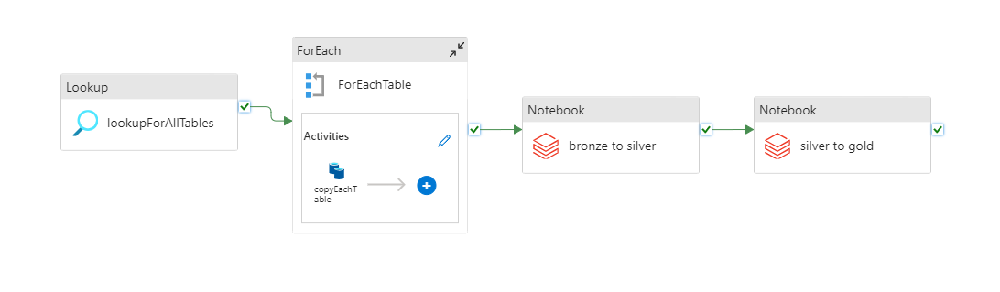
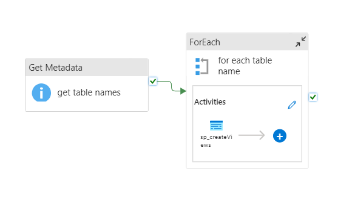
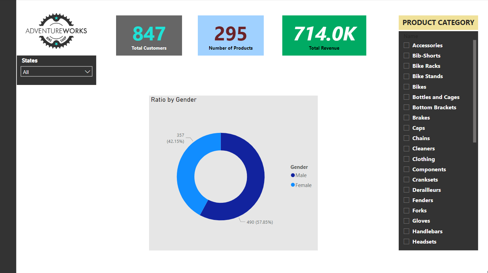

# Adventure Works 2022 Data Engineering Project

## Overview

This report provides an in-depth look at the data engineering project centered around Adventure Works sales data for the year 2022. The project involved the meticulous design and implementation of a comprehensive data warehouse architecture, leveraging On-premises SQL, Azure Data Factory, Azure Databricks, Azure Synapse Analytics, and Power BI.

## Data Source

The project utilizes sales data from Microsoft's Adventure Works sample database, accessible at [Microsoft Adventure Works](https://learn.microsoft.com/en-us/sql/samples/adventureworks-install-configure?view=sql-server-ver16&tabs=ssms). The data has been loaded into an On-premises SQL Server, serving as the cornerstone data source. A copy of the backup file is stored in the repository at [Data Source](./Data%20Source).

## Data Ingestion

A pivotal aspect of the on-premises to cloud architecture was the use of Azure Data Factory to ingest raw data into a Data Lake Gen 2 container. Employing a self-hosted integration runtime installed on the local machine facilitated the connection to the On-premises SQL Server. With the assistance of a well-defined pipeline, all data was efficiently loaded into the bronze (raw) container. Configuration files related to this process can be found in [ADF_pipeline](./ADF_pipeline).
.

## Data Transformation

While the data was largely cleaned before reaching the on-premises environment, a three-layered approach was adopted for the sake of an industrial scenario. The data was stratified into bronze (raw), silver (partially transformed), and gold (fully transformed and analytically ready) layers. Minor transformations were applied using Databricks, and the sequentially transformed data was loaded into the respective containers. These transformation steps were seamlessly integrated into the ADF pipeline, ensuring automatic execution whenever new data arrived. Notebooks can be found at [Databricks](./databricks)

## Data Analytics

A dedicated database in Azure Synapse Analytics was created, with data from the Gold layer loaded into it. Instead of importing actual data into the Synapse database, a cost-effective approach was taken. Stored procedures were crafted to generate views directly from the Data Lake Gen2 gold container. These stored procedures are triggered by a pipeline within Synapse, ensuring the maintenance of fresh data views. Config files can be found in [Synapse Anlytics](./Synapse_Analytics).

## Dashboards

The data, now residing in Synapse, was imported into Power BI workspace to create data-driven interactive dashboards. A sample dashboard showcasing key visuals and filters has been created. For example, the dashboard includes cards displaying total revenue and total customers, accompanied by slicers for product categories and a ratio of customers based on gender. The dashboard is located at [Dashboard](./PowerBI)

---

This project seamlessly integrates diverse technologies, transforming raw data into actionable insights and providing a solid foundation for decision-making.

